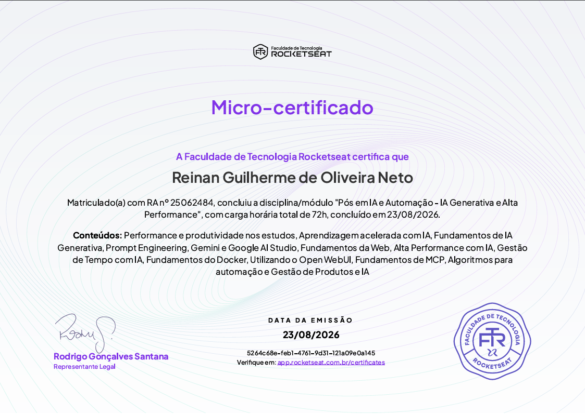

# 🤖 IA Generativa e Alta Performance

> **Módulo 1** — Pós-graduação em IA e Automação

Primeiro módulo da pós, dedicado a entender como a Inteligência Artificial generativa funciona por dentro e como usá-la de forma prática — tanto para produzir mais e melhor no dia a dia quanto para construir soluções reais, mesmo sem escrever código.

---

## 📚 O que foi aprendido

### Estudo, aprendizagem e produtividade

O módulo começa pela base: como aprender melhor. Aqui entrou a parte de neurociência aplicada aos estudos, planejamento e organização da rotina de aprendizagem, e como montar um plano de estudos que privilegia retenção em vez de esforço bruto.

Na sequência, essas estratégias foram combinadas com IA. Técnicas clássicas como **SMART** e **Feynman** foram adaptadas ao uso de IA generativa para transformar livros, vídeos, artigos e documentos em conhecimento estruturado — gerando resumos, mapas mentais, visualizações e até podcasts a partir do próprio material de estudo.

### Fundamentos de IA Generativa

A parte conceitual do módulo: o que são os modelos generativos, como eles realmente funcionam e por que funcionam. O foco principal ficou na arquitetura dos **Transformers**, que é a base dos modelos atuais, e em como isso se traduz na prática em tarefas de raciocínio, geração de código e automação de processos.

### Engenharia de Prompt

Como conversar com um modelo de forma que ele entregue o que se espera. Foram trabalhadas estratégias de construção e otimização de prompts para diferentes contextos, entendendo o impacto de estrutura, contexto e clareza na qualidade da resposta — com aplicações práticas, como a geração automatizada de relatórios.

### Ferramentas do ecossistema Google

Exploração do **Gemini** e do **Google AI Studio**: conceito de tokens, modelos multimodais, diferenças entre os planos, e recursos avançados como Deep Research, Canvas, geração de imagens, vídeos e textos, além da integração com os demais aplicativos do Google.

### Fundamentos da Web

Uma base técnica necessária para quem vai trabalhar com automação: como aplicações conversam entre si por meio de **APIs** e **JSON**, o que é Web Scraping, como o HTML e a **DOM** se estruturam, e como funciona a infraestrutura por trás dos servidores.

Depois, um aprofundamento em **HTTP** — requisições e respostas, o modelo *stateless* e o papel do navegador nesse fluxo. É o vocabulário que permite entender o que está acontecendo quando uma automação chama um serviço externo.

### Alta performance profissional e gestão de tempo

A ponte entre a ferramenta e a carreira. Os pilares de clareza, energia e foco aplicados ao desenvolvimento pessoal, tratando a IA como copiloto estratégico para produtividade, comunicação e aprendizado contínuo.

Também foi abordado o uso da IA na organização pessoal e profissional: priorização de tarefas, estruturação de rotinas e estratégias práticas para ganhar tempo no dia a dia.

### Docker e Open WebUI

Parte mais hands-on do módulo. Primeiro os fundamentos do **Docker** — conceitos, instalação, uso por interface gráfica e por linha de comando, e criação e gerenciamento de containers para ambientes portáteis e consistentes.

Com essa base, veio o **Open WebUI**: instalação, configuração e uso para gerenciar LLMs, integração com APIs, bases de conhecimento, personalização de modelos, colaboração em grupo e orquestração via **Portainer** — rodando tanto localmente quanto em VPS, com atenção a privacidade.

### MCP e automação

Conceitos e aplicações do **Model Context Protocol (MCP)**: a evolução dos bots até os agentes de IA, o funcionamento do *Function Calling*, a integração entre modelos, ferramentas e hosts, e boas práticas de segurança.

Fechando essa parte, o pensamento computacional aplicado à automação — decomposição, abstração, reconhecimento de padrões e construção de algoritmos — com aplicação prática em ferramentas como o **n8n**.

### Gestão de produtos com IA

Como a IA entra no ciclo de vida de um produto, da concepção à entrega: apoio à tomada de decisão estratégica, análise de dados, personalização de experiências e otimização de processos.

---

## 🧪 Projeto final

**Assistente Especializado com NotebookLM**

Desafio prático de encerramento do módulo, em que foi preciso ir além de apenas configurar uma IA e assumir dois papéis ao mesmo tempo: o de criador de produto, definindo o propósito e o público do assistente, e o de engenheiro de prompts, moldando o comportamento e as respostas dele.

---

## 🧰 Ferramentas e tecnologias

`IA Generativa` · `Transformers` · `Prompt Engineering` · `Gemini` · `Google AI Studio` · `NotebookLM` · `Docker` · `Open WebUI` · `Portainer` · `MCP` · `Function Calling` · `n8n` · `APIs` · `JSON` · `HTTP` · `Web Scraping`

---

## 🎓 Certificado

[](../assets/certificado-ia-generativa-alta-performance.pdf)

📄 [Abrir certificado em PDF](../assets/certificado-ia-generativa-alta-performance.pdf)

📄 [Abrir certificado em PDF](assets/certificado-ia-generativa-alta-performance.pdf)

---

## 📁 Estrutura do projeto

```
.
rocketseat-pos-graduacao-em-ia-automacao/
├── assets/
│   ├── certificado-ia-generativa-alta-performance.pdf
│   └── certificado-ia-generativa-alta-performance.png
└── Modulo-1-Avaliacao-IA-Generativa-e-Alta-Performance/
    └── README.md
```

---

Este módulo faz parte da pós-graduação em **IA e Automação**. Os próximos serão adicionados ao repositório conforme forem concluídos.
